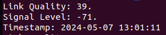

# embedded_linux
For the project we have to do in Embedded Linux.

## The Drone
Requirement M:

When the "wifi_logging.sh" bash script is run it prints out the following output:

The output contains:
1. The link quality
2. The signal level
3. The current timestamp

This output is stored in an SQLite3 database called logWifi.db. 
